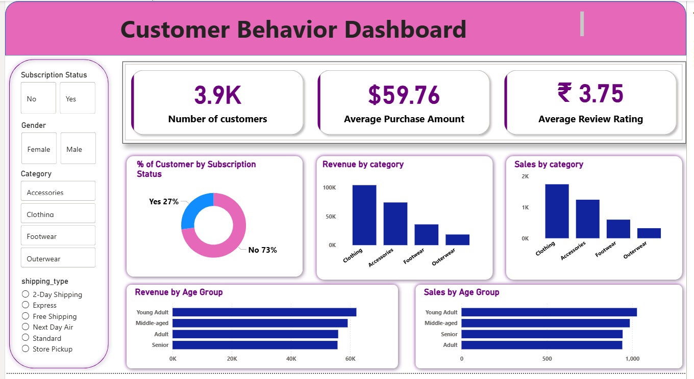

# Retail Customer Behavior Analysis

## Overview
This project analyzes customer shopping behavior using Python, SQL, and Power BI.  
The goal is to understand customer patterns, spending habits, and business insights.

---

## Dataset
- Customer shopping dataset (CSV)
- Includes details like:
  - Age, Gender
  - Product category
  - Purchase amount
  - Review rating
  - Subscription status
  - Shipping type

---

## Tools & Technologies
- Python (Pandas, NumPy)
- SQL (MySQL)
- Power BI
- Jupyter Notebook

---

## Steps Performed

### 1. Data Loading
- Loaded dataset using Python (Pandas)

### 2. Data Cleaning
- Handled missing values
- Checked data types
- Removed duplicates

### 3. Exploratory Data Analysis (EDA)
- Analyzed customer distribution
- Category-wise sales
- Age group analysis
- Subscription insights

### 4. SQL Analysis
- Wrote queries to answer business questions like:
  - Revenue by gender
  - Top products
  - Discount usage
  - Customer segmentation

### 5. Power BI Dashboard
- Created interactive dashboard
- Visualized:
  - Revenue by category
  - Sales by age group
  - Subscription distribution
  - Key KPIs

---

## Dashboard Preview

---

## Key Insights
- Clothing category generates highest revenue
- Majority customers are non-subscribers
- Young adults contribute more to sales
- Discounts influence purchase behavior

---

## How to Run

1. Open Python notebook in `python/` folder  
2. Run all cells for EDA  
3. Use SQL queries from `sql/` folder  
4. Open Power BI file from `powerbi/` folder  

---

## Project Structure
